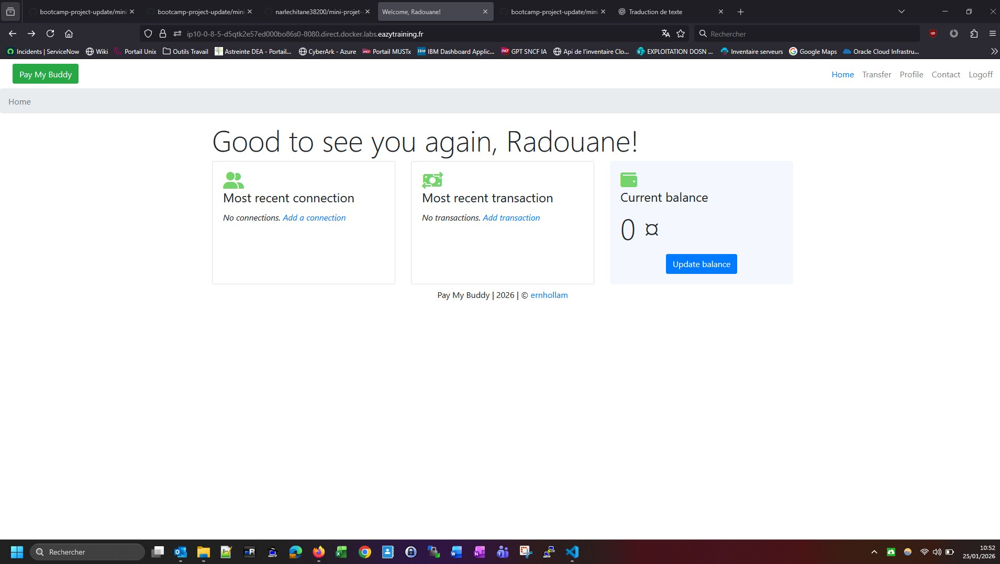

# PayMyBuddy - Financial Transaction Application

## 🧾 Présentation 

**PayMyBuddy** est une application permettant de gérer des transactions financières entre amis.

L’infrastructure actuelle est fortement couplée et déployée manuellement, ce qui engendre des inefficacités et complique la montée en charge. Ce projet vise à **améliorer la scalabilité** et à **simplifier le processus de déploiement** grâce à l’utilisation de **Docker** et de l’orchestration de conteneurs.

---

## 🎯 Objectifs du projet

* Conteneuriser l’application backend Spring Boot
* Conteneuriser la base de données MySQL
* Automatiser le déploiement de l’ensemble de la stack
* Faciliter la maintenance et l’évolution de l’infrastructure

---

## 🏗️ Infrastructure

L’infrastructure cible s’exécute sur un serveur **Ubuntu 20.04** avec **Docker** activé.

Ce projet correspond à une **preuve de concept (POC)** reposant sur **Docker Compose** pour orchestrer les différents services.

### Composants

* **Backend (Spring Boot)**
  Gère les données utilisateurs et les transactions financières

* **Base de données (MySQL)**
  Stocke les informations relatives aux utilisateurs, aux transactions et aux comptes

* **Orchestration (Docker Compose)**
  Permet de gérer et de déployer l’ensemble de la stack applicative

---

## 🧩 Architecture de l’application

PayMyBuddy est composée de **deux services principaux** :

### 🔹 Backend Service (Spring Boot)

* Expose une API REST pour :

  * la gestion des utilisateurs
  * les interactions entre utilisateurs
  * les transactions financières
* Se connecte à une base de données MySQL pour assurer un stockage persistant

### 🔹 Database Service (MySQL)

* Stocke les données utilisateurs et les transactions
* Exposée sur le **port 3306** afin de permettre la connexion du backend

---

## 🚀 Technologies utilisées

* **Java / Spring Boot**
* **MySQL**
* **Docker**
* **Docker Compose**
* **Ubuntu 20.04**

---

## 📌 Réalisation du projet par étapes

* **Clone du repo git en local**:

```bash
[node2] (local) root@10.0.8.5 ~
$ git clone https://github.com/narlechitane38200/bootcamp-project-update.git
Cloning into 'bootcamp-project-update'...
remote: Enumerating objects: 455, done.
remote: Counting objects: 100% (44/44), done.
remote: Compressing objects: 100% (42/42), done.
remote: Total 455 (delta 24), reused 0 (delta 0), pack-reused 411 (from 2)
Receiving objects: 100% (455/455), 41.37 MiB | 24.51 MiB/s, done.
Resolving deltas: 100% (161/161), done.

[node2] (local) root@10.0.8.5 ~/bootcamp-project-update/mini-projet-docker
$ ls -rtlh
total 20K    
drwxr-xr-x    8 root     root         191 Jan 25 08:55 target
drwxr-xr-x    4 root     root          30 Jan 25 08:55 src
-rw-r--r--    1 root     root        3.7K Jan 25 08:55 pom.xml
drwxr-xr-x    2 root     root          24 Jan 25 08:55 initdb
-rw-r--r--    1 root     root         729 Jan 25 08:55 docker-compose.yml
-rw-r--r--    1 root     root        4.6K Jan 25 08:55 README.md
-rw-r--r--    1 root     root         420 Jan 25 08:55 Dockerfile
```

* **Création du fichier Dockerfile pour le backend**

```bash
# --- Étape 1 : Build de l'application ---
FROM amazoncorretto:17-alpine AS builder
WORKDIR /app

# Copie des fichiers source 
COPY . .

# --- Étape 2 : Image de runtime ---
FROM amazoncorretto:17-alpine

# Dossier de travail
WORKDIR /app

# Copier uniquement le JAR final
COPY --from=builder /app/target/*.jar app.jar

# Exposer le port Spring Boot
EXPOSE 8080

# Lancement de l'application
CMD ["java", "-jar", "app.jar"]
```

* **Build de l'image à partir du Dockerfile**

```bash
$ docker build -t backend-app .
[+] Building 8.2s (9/9) FINISHED                                                                                                                               docker:default
 => [internal] load .dockerignore                                                                                                                                        0.0s
 => => transferring context: 167B                                                                                                                                        0.0s
 => [internal] load build definition from Dockerfile                                                                                                                     0.0s
 => => transferring dockerfile: 520B                                                                                                                                     0.0s
 => [internal] load metadata for docker.io/library/amazoncorretto:17-alpine                                                                                              1.1s
 => [internal] load build context                                                                                                                                        0.7s
 => => transferring context: 46.35MB                                                                                                                                     0.7s
 => [builder 1/3] FROM docker.io/library/amazoncorretto:17-alpine@sha256:efb556c2994b79d5b4dbfbed803b552603ac9157ac3dfadaf8f8f631badf5066                                4.5s
 => => resolve docker.io/library/amazoncorretto:17-alpine@sha256:efb556c2994b79d5b4dbfbed803b552603ac9157ac3dfadaf8f8f631badf5066                                        0.0s
 => => sha256:5220b5ae21ae6bd0bebdac78df673c993f7b612c0373a1c380b2a915968e170f 2.48kB / 2.48kB                                                                           0.0s
 => => sha256:1074353eec0db2c1d81d5af2671e56e00cf5738486f5762609ea33d606f88612 3.86MB / 3.86MB                                                                           0.3s
 => => sha256:f9893ff21f339b1dac915f0c4f4babba1b9eea3f0737be3f8bc2cf8e11d24c0c 148.37MB / 148.37MB                                                                       1.8s
 => => sha256:efb556c2994b79d5b4dbfbed803b552603ac9157ac3dfadaf8f8f631badf5066 2.67kB / 2.67kB                                                                           0.0s
 => => sha256:db668792bc278c8ffa9113d92407a4640c22874e34ee6b34cd9cdf805a49dc72 1.37kB / 1.37kB                                                                           0.0s
 => => extracting sha256:1074353eec0db2c1d81d5af2671e56e00cf5738486f5762609ea33d606f88612                                                                                0.3s
 => => extracting sha256:f9893ff21f339b1dac915f0c4f4babba1b9eea3f0737be3f8bc2cf8e11d24c0c                                                                                2.5s
 => [builder 2/3] WORKDIR /app                                                                                                                                           1.6s
 => [builder 3/3] COPY . .                                                                                                                                               0.4s
 => [stage-1 3/3] COPY --from=builder /app/target/*.jar app.jar                                                                                                          0.2s
 => exporting to image                                                                                                                                                   0.2s
 => => exporting layers                                                                                                                                                  0.2s
 => => writing image sha256:656362a5365383a474d61420671396e6b3e1b09f38ba72a76d5787b72bb5b881                                                                             0.0s
 => => naming to docker.io/library/backend-app

$ docker images
REPOSITORY    TAG       IMAGE ID       CREATED         SIZE
backend-app   latest    656362a53653   5 seconds ago   340MB                                                                                                                           0.0s
```

* **Déploiement d'un registre privé + dasboard web (depuis un docker-compose-registry.yml) et tag/push de l'image**

```bash
[node1] (local) root@10.0.1.4 ~/mini-projet-docker-commun
$ docker compose -f docker-compose-registry.yml up -d
[+] Running 20/20
 ✔ registry-ui 13 layers [⣿⣿⣿⣿⣿⣿⣿⣿⣿⣿⣿⣿⣿]      0B/0B      Pulled                                                                               2.6s 
   ✔ 1074353eec0d Pull complete                                                                                                               0.3s 
   ✔ 25f453064fd3 Pull complete                                                                                                               0.3s 
   ✔ 567f84da6fbd Pull complete                                                                                                               0.3s 
   ✔ da7c973d8b92 Pull complete                                                                                                               0.5s 
   ✔ 33f95a0f3229 Pull complete                                                                                                               0.5s 
   ✔ 085c5e5aaa8e Pull complete                                                                                                               0.5s 
   ✔ 0abf9e567266 Pull complete                                                                                                               0.8s 
   ✔ 4f4fb700ef54 Pull complete                                                                                                               0.8s 
   ✔ 86542d87c26f Pull complete                                                                                                               0.8s 
   ✔ f00587c9d3c4 Pull complete                                                                                                               1.0s 
   ✔ 4938dcb4f5b5 Pull complete                                                                                                               1.1s 
   ✔ 7c58ebf04d2e Pull complete                                                                                                               1.1s 
   ✔ eee8323a8c5c Pull complete                                                                                                               1.3s 
 ✔ registry-private 5 layers [⣿⣿⣿⣿⣿]      0B/0B      Pulled                                                                                   3.2s 
   ✔ 44cf07d57ee4 Pull complete                                                                                                               1.4s 
   ✔ bbbdd6c6894b Pull complete                                                                                                               1.4s 
   ✔ 8e82f80af0de Pull complete                                                                                                               1.7s 
   ✔ 3493bf46cdec Pull complete                                                                                                               1.8s 
   ✔ 6d464ea18732 Pull complete                                                                                                               1.8s 
[+] Building 0.0s (0/0)                                                                                                             docker:default
[+] Running 4/4
 ✔ Network mini-projet-docker-commun_default               Created                                                                            0.0s 
 ✔ Volume "mini-projet-docker-commun_registry_data"        Created                                                                            0.0s 
 ✔ Container mini-projet-docker-commun-registry-private-1  Started                                                                            0.1s 
 ✔ Container mini-projet-docker-commun-registry-ui-1       Started                                                                            0.0s 

[node1] (local) root@10.0.1.4 ~/mini-projet-docker-commun
$ docker images
REPOSITORY                 TAG       IMAGE ID       CREATED         SIZE
backend-app                latest    02069ee02e51   6 minutes ago   340MB
joxit/docker-registry-ui   latest    fc0c719c7b3f   4 weeks ago     22.1MB
registry                   2         26b2eb03618e   2 years ago     25.4MB
[node1] (local) root@10.0.1.4 ~/mini-projet-docker-commun
$ docker tag backend-app:latest localhost:5000/backend-app:latest
[node1] (local) root@10.0.1.4 ~/mini-projet-docker-commun
$ docker images
REPOSITORY                   TAG       IMAGE ID       CREATED         SIZE
backend-app                  latest    02069ee02e51   7 minutes ago   340MB
localhost:5000/backend-app   latest    02069ee02e51   7 minutes ago   340MB
joxit/docker-registry-ui     latest    fc0c719c7b3f   4 weeks ago     22.1MB
registry                     2         26b2eb03618e   2 years ago     25.4MB
[node1] (local) root@10.0.1.4 ~/mini-projet-docker-commun
$ docker push localhost:5000/backend-app:latest
The push refers to repository [localhost:5000/backend-app]
85e6f29281a2: Pushed 
1df879280d71: Pushed 
3d146006478f: Pushed 
989e799e6349: Pushed 
latest: digest: sha256:5548b3a8983dfcb5f1633ea84c2890522fbfaaf71ebf520c721bdfab5a85467a size: 1160
[node1] (local) root@10.0.1.4 ~/mini-projet-docker-commun
$ curl -X GET http://localhost:5000/v2/_catalog
{"repositories":["backend-app"]}
```

* **Génération d'un fichier .env contenant les valeurs des paramètres appelés dans le fichier docker-compose**

```bash
MYSQL_ROOT_PASSWORD=***
DB_USER=***
DB_PASSWORD=***
```

* **Création d'un fichier docker-compose.yml pour déploiement de l'application (backend+mysql)**

```yaml
services:

  paymybuddy-db:
    image: mysql:8.0
    restart: always
    environment:
      MYSQL_ROOT_PASSWORD: ${MYSQL_ROOT_PASSWORD}
    ports:
      - "3306:3306"
    volumes:
      - mysql-data:/var/lib/mysql
      - ./initdb:/docker-entrypoint-initdb.d
    networks:
      - paymybuddy-net

  paymybuddy-backend:
    image: localhost:5000/backend-app:latest
    restart: always
    depends_on:
      - paymybuddy-db
    environment:
      SPRING_DATASOURCE_URL: jdbc:mysql://paymybuddy-db:3306/db_paymybuddy
      SPRING_DATASOURCE_USERNAME: ${DB_USER}
      SPRING_DATASOURCE_PASSWORD: ${DB_PASSWORD}
    ports:
      - "8080:8080"
    networks:
      - paymybuddy-net

volumes:
  mysql-data:

networks:
  paymybuddy-net:
```

* **Déploiement de l'application via docker-compose**

```bash
$ docker compose up -d 
[+] Running 3/12
[+] Running 12/1211 layers [⣤⣿⣿⠀⣿⠀⠀⠀⠀⠀⠀] 25.55MB/53.49MB Pulling                                                                                                         2.1s 
 ✔ paymybuddy-db 11 layers [⣿⣿⣿⣿⣿⣿⣿⣿⣿⣿⣿]      0B/0B      Pulled                                                                                                         15.5s 
   ✔ 16506d4b4233 Pull complete                                                                                                                                          0.9s 
   ✔ 3387bdf9bfcc Pull complete                                                                                                                                          0.4s 
   ✔ 5a35458f48a1 Pull complete                                                                                                                                          0.4s 
   ✔ 1bed572afc9f Pull complete                                                                                                                                          0.8s 
   ✔ f3e7871685d1 Pull complete                                                                                                                                          0.8s 
   ✔ 9e9c9ba70723 Pull complete                                                                                                                                          1.2s 
   ✔ be113d11b355 Pull complete                                                                                                                                          2.0s 
   ✔ 05bdba050124 Pull complete                                                                                                                                          1.3s 
   ✔ 54a2bfb30cdf Pull complete                                                                                                                                          3.5s 
   ✔ 05ed66656b21 Pull complete                                                                                                                                          1.7s 
   ✔ 1c0ceff8a81b Pull complete                                                                                                                                          2.1s 
[+] Building 0.0s (0/0)                                                                                                                                        docker:default
[+] Running 4/4
 ✔ Network mini-projet-docker_paymybuddy-net          Created                                                                                                            0.0s 
 ✔ Volume "mini-projet-docker_mysql-data"             Created                                                                                                            0.0s 
 ✔ Container mini-projet-docker-paymybuddy-db-1       Started                                                                                                            4.9s 
 ✔ Container mini-projet-docker-paymybuddy-backend-1  Started                                                                                                            0.0s 
[node2] (local) root@10.0.8.5 ~/bootcamp-project-update/mini-projet-docker
$ docker ps
CONTAINER ID   IMAGE                               COMMAND                  CREATED          STATUS          PORTS                               NAMES
dc9be71d8ae1   localhost:5000/backend-app:latest   "java -jar app.jar"      14 seconds ago   Up 2 seconds    0.0.0.0:8080->8080/tcp              mini-projet-docker-paymybuddy-backend-1
aaaf49ddd7d5   mysql:8.0                           "docker-entrypoint.s…"   19 seconds ago   Up 13 seconds   0.0.0.0:3306->3306/tcp, 33060/tcp   mini-projet-docker-paymybuddy-db-1
e482e8a83c2a   registry:2                          "/entrypoint.sh /etc…"   2 minutes ago    Up 2 minutes    0.0.0.0:5000->5000/tcp              myregistry
```

---

## 🚀 Test applicatif via port 8080


<p align="center">
  
</p>


